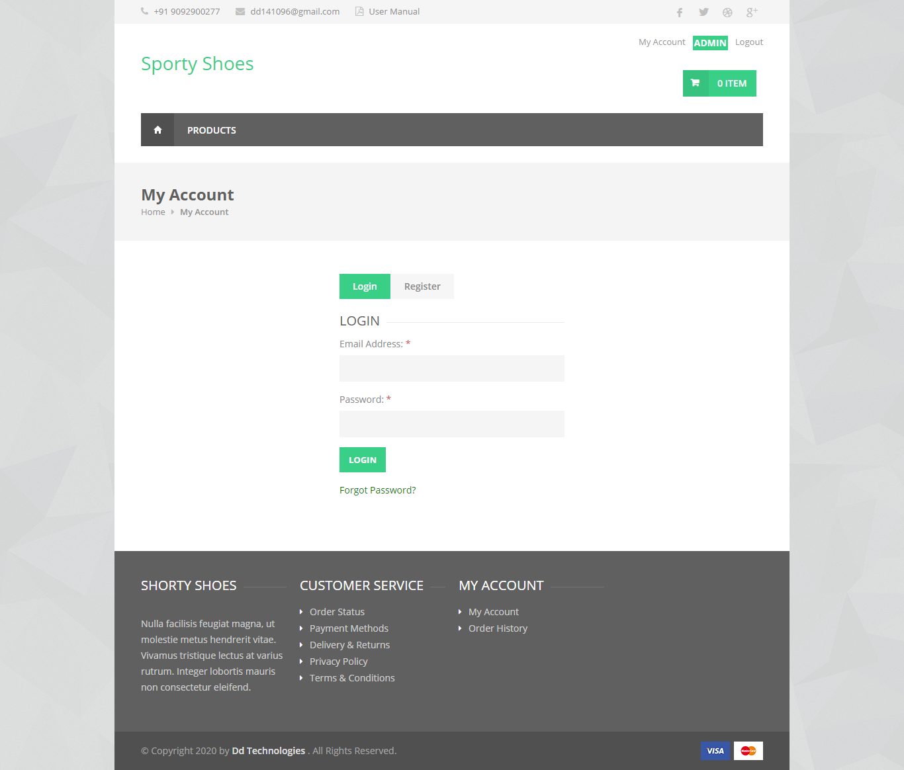

# Welcome to Sporty Shoes User Guide! {docsify-ignore}

> Our SportyShoes version 1.0 have some important features like user registration, user login, forgot password, viewing our products, adding the products to the cart and the checkout options.

> This Version is developed on Spring Boot framework is based on Java’s spring framework which was introduced before around 15 years. So it is Mature. It is lightweight as compared to other Java stacks. So, maturity + lightweight makes a great combination, and that is one strong reason to choose Spring Boot over any other technologies.

> Our technologies used like Hibernate(ORM) for communicating with the Database, HTML, CSS, JavaScript, JQuery for web templates designing purpose. We have used the bootstrap templates so it is responsive on the mobile devices also.

