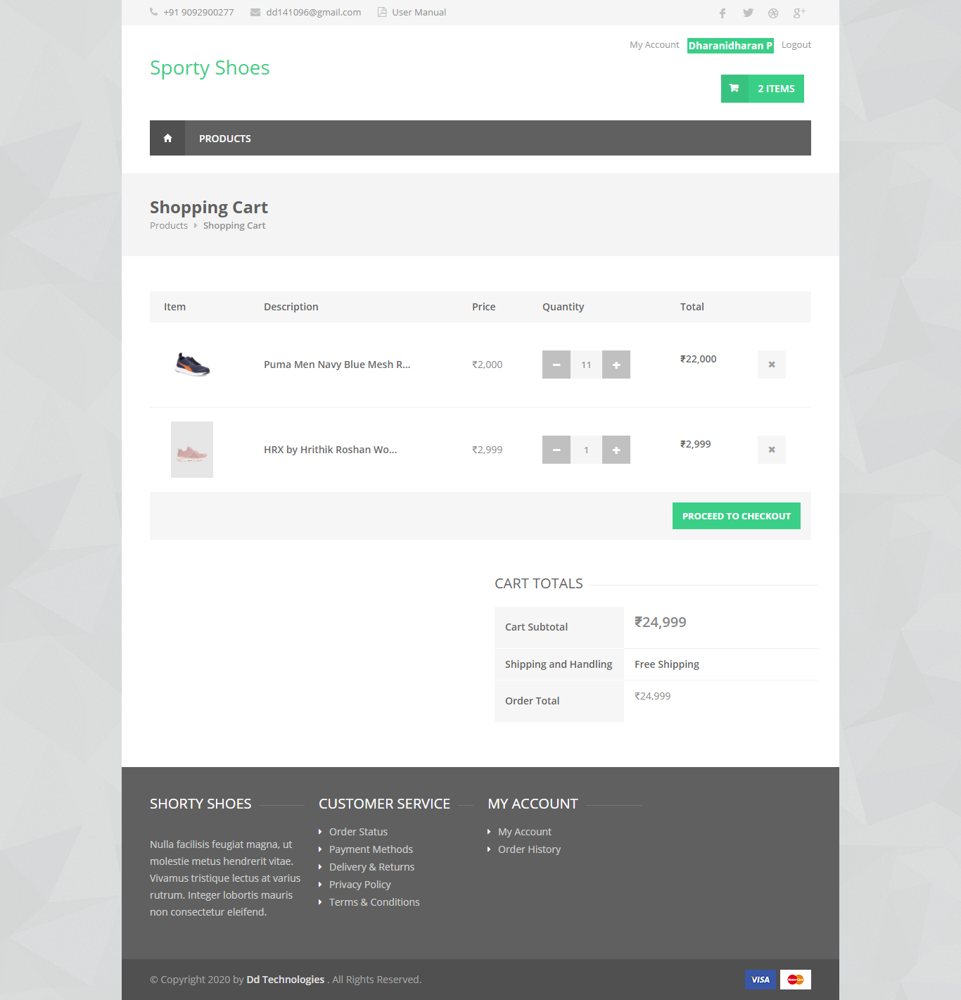
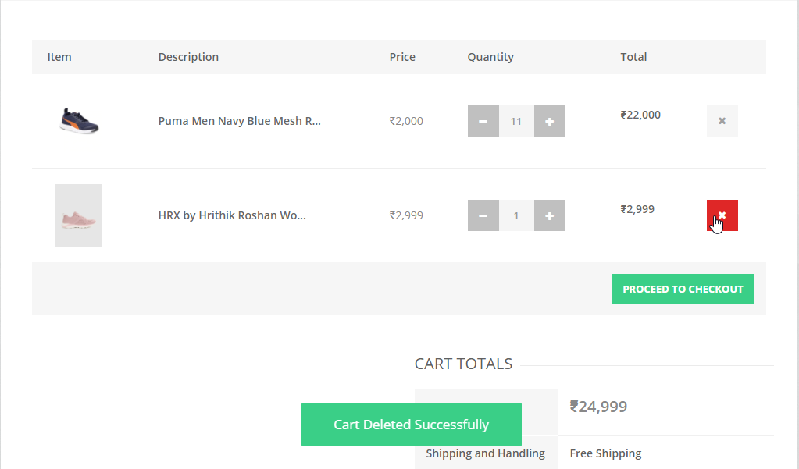
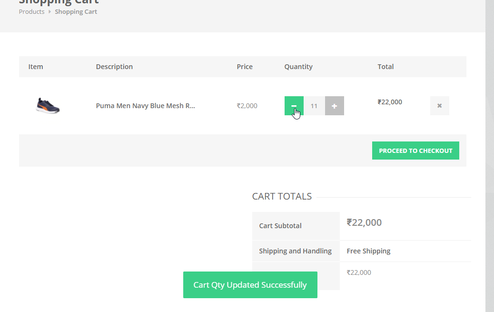

# SportyShoes Carts

## Introduction

> user-added products are displayed in the cart page, User can able to delete the items from the cart and user can increase or decrease the quantity of the items in the cart.

## Delete the item from Cart

> User can able to delete the items from the cart by clicking the delete button.

## Update the item Quantity in Cart

> User can update the Quantities of the items in the cart

{docsify-updated}

