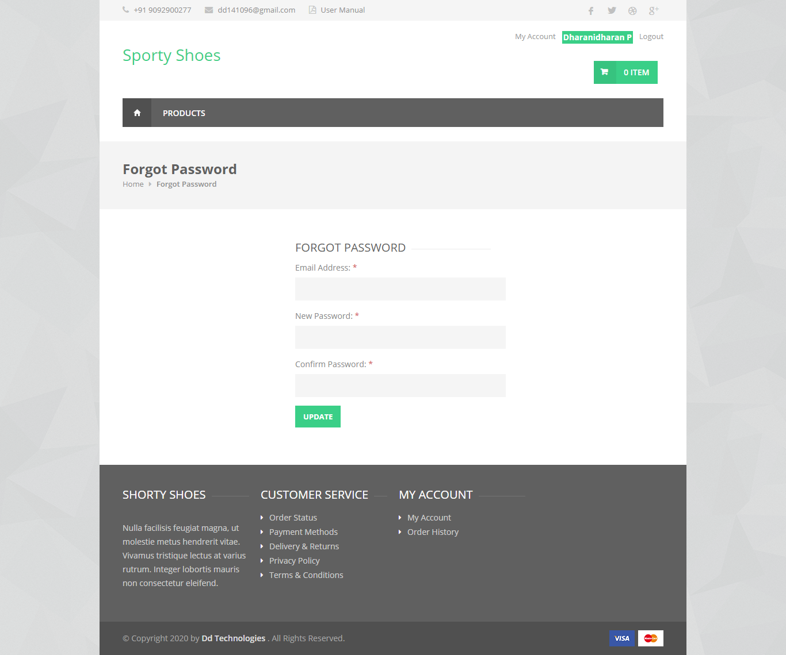
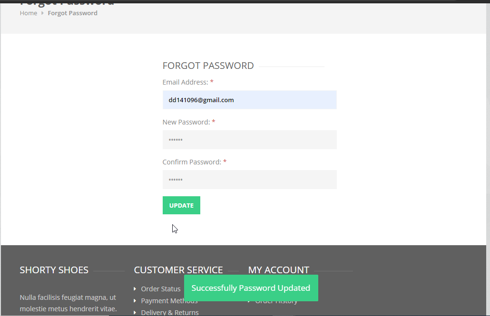

# SportyShoes ForgetPassword

## Introduction

> SportyShoes users can change the password if they forget it. So issues in changing the password. Just they need to enter the registered email id and the new password to update

## How to Change the Password?

> Fill the mandatory fields in the form like email id and password and proceed with update
 
#### Success Messages

>**Password Updated Successfully**
	- If the user enters the correct email and password then after clicking the update button user get the success message for update password.
	

{docsify-updated}

