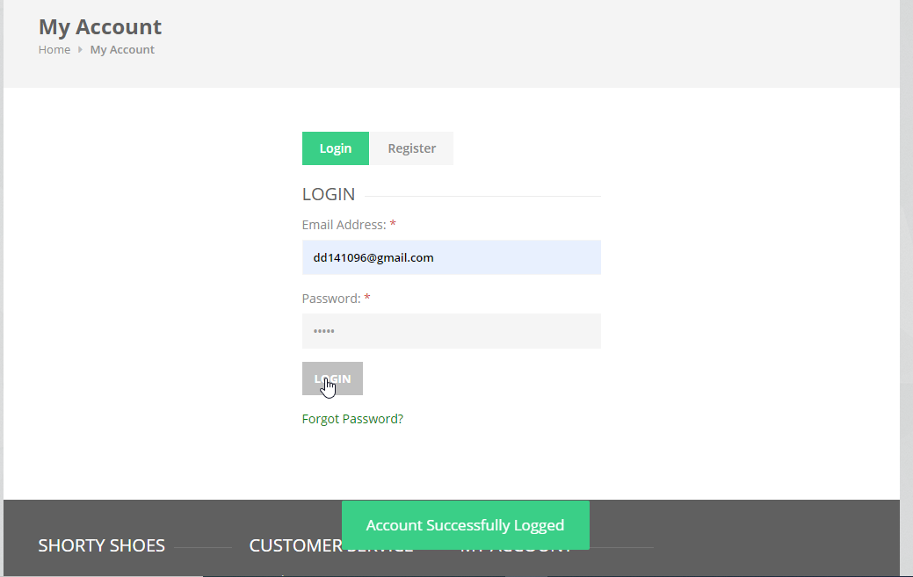

# SportyShoes Login

## Introduction

> SportyShoes Login Page is easy and able to access by the all the registered. They to enter their registered email id and password to login.

## How to Login?

> User needs to enter their registered email id and password to login. Once logged in user can able to see the items in the cart, able to add the items in the cart
 

 

#### Errors & Warnings

The below warning / error message will be displayed to the user in case of any invalid action.
The warning / error messages are self explanatory, here are few examples.

!>**Enter the E**
	- If the user tries to log in without entering the username.
	
!>**Enter the Password**
	- If the user tries to log in without entering the password.
	

   

#### Success Messages

>**Login Successfully**
	- If the user enters the correct email and password then after clicking the login button user get the success message for login.
	

{docsify-updated}

