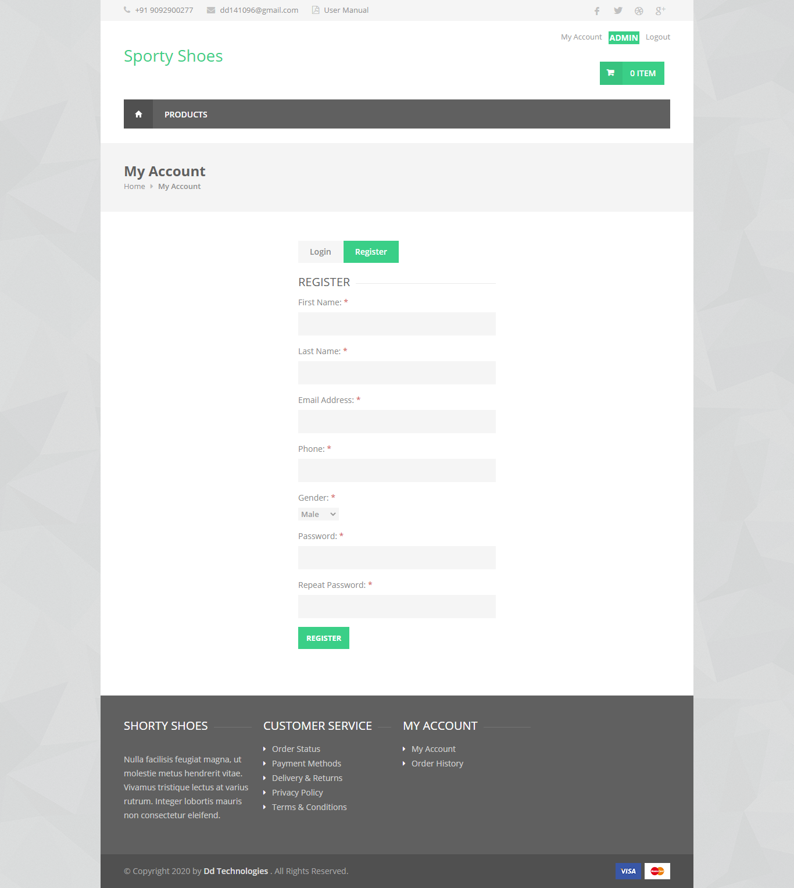
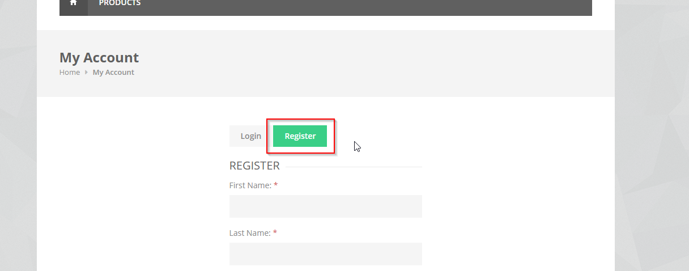
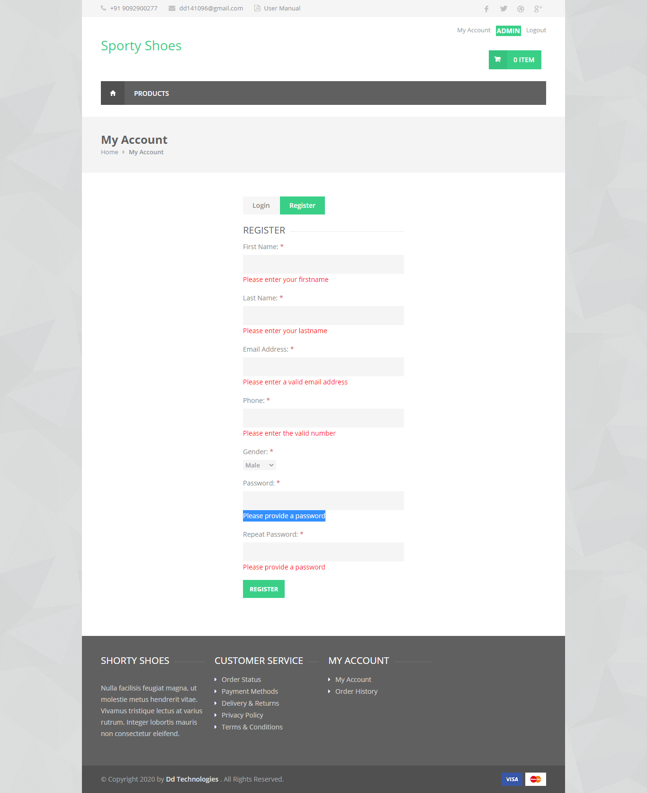
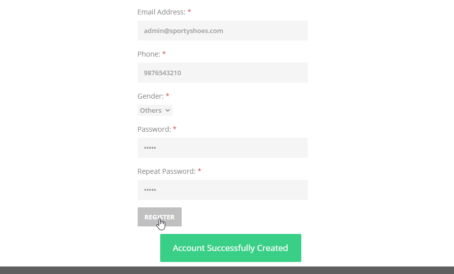

# SportyShoes User Registration

## Introduction

> Every user should need to register to purchase the products from sporty shoes and to get better discounts. User registration is a 2 minutes process just by entering the unique email id and phone number of the users.

## How to Register?

> Just by clicking register tab in the index page and fill the form mandatory details.
 

 

#### Errors & Warnings

The below warning / error message will be displayed to the user in case of any invalid action.
The warning / error messages are self explanatory, here are few examples.

!>**Please enter your firstname**
	- If the user tries to register without entering the firstname.
	
!>**Please enter your lastname**
	- If the user tries to register without entering the lastname.
	
!>**Please enter a valid email address**
	- If the user tries to register without entering the email address.
	
!>**Please enter the valid number**
	- If the user tries to register without entering the mobile number.

!>**Please provide a password**
	- If the user tries to register without entering the password.
	

   

#### Success Messages

>**Login Successfully**
	- If the user enters the all the mandatory details and hit enters means. It will show the pop up as below
	

{docsify-updated}

